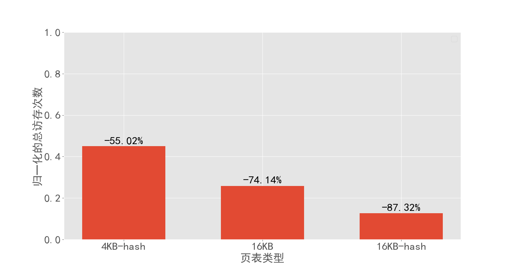
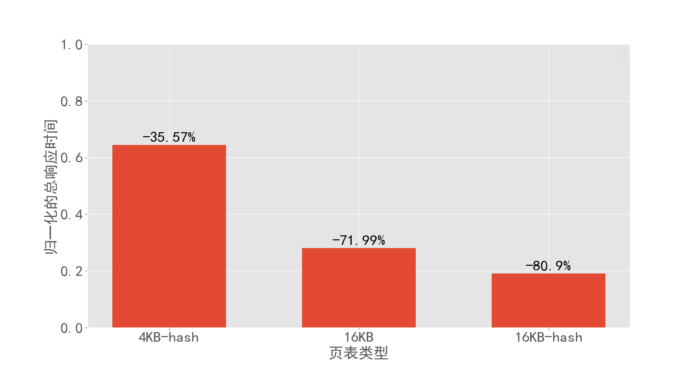
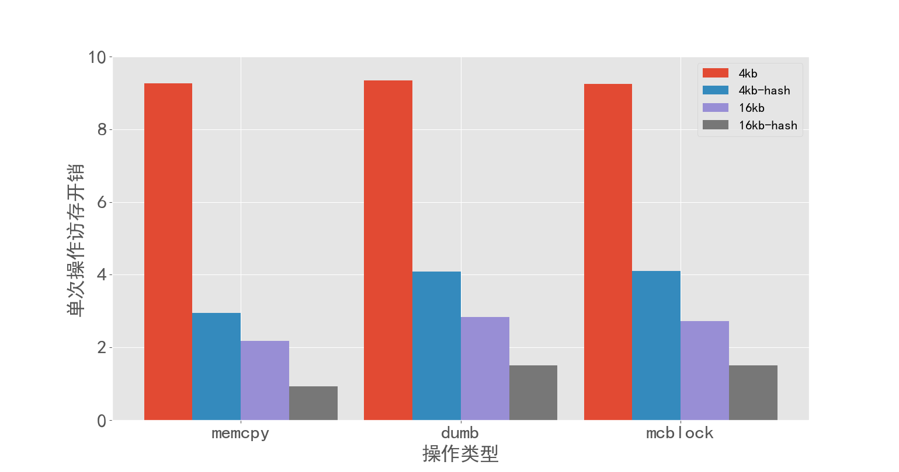
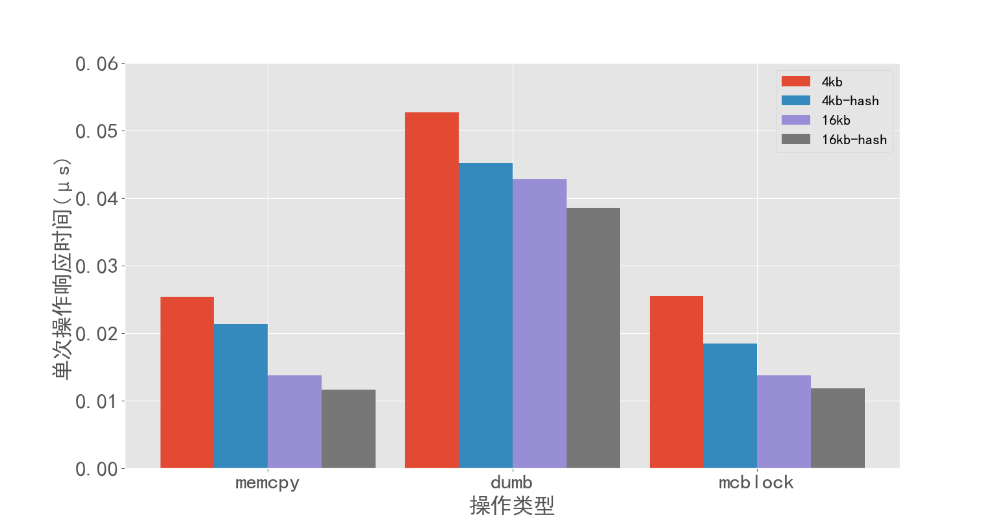
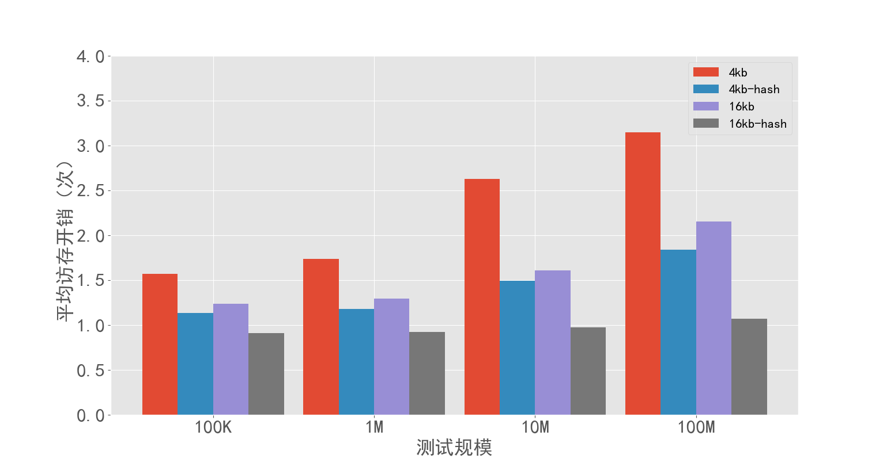
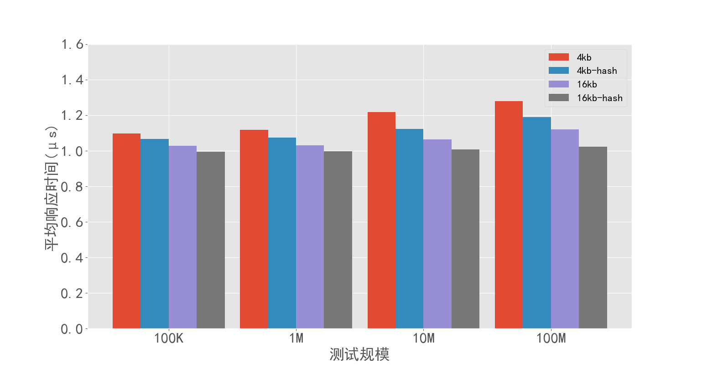

# Page table using hash table

题目链接：[Proj121-Page table using hash table](https://github.com/oscomp/proj121-page-table-using-hashtable)&emsp;难度：**高**

更详细的内容可以观看[2022全国大学生系统能力大赛操作系统设计赛第九场技术培训会项目四](https://www.bilibili.com/video/BV1hd4y1U7TH?spm_id_from=333.337.search-card.all.click)&emsp;[Proj121 直播录屏（纯享版）][百度网盘视频链接](https://pan.baidu.com/s/1YLOQqtWM9v39igDmvJdRVg?pwd=8zhf)

## 项目概述
    
影响虚拟机访存性能的因素较多，从页表的角度来看，随着系统内存容量的快速增长，目前普遍采用的4KB页面导致了TLB条目数量过多，TLB换入换出开销较大，无法满足云计算性能要求，迫切需要更大粒度的页面（8KB以上）支持。而现有的RISC-V只支持4KB页大小，对内存需求较大的应用不友好。
    
本项目为Linux Kernel中搭建了一个16KB粒度的虚拟内存系统，实现了16KB粒度的two stage的内核虚拟化流程，设计并完成了在stage-2阶段的哈希寻址模式。这些工作有效提升了地址翻译的效率，从而提升了基于RISC-V处理器的Linux系统在内存敏感应用场景下的性能，为解决服务器的高性能计算需求提出了一个可行的解决方案，也为扩展RISC-V生态做出了贡献。
    
为了进一步提升系统访存性能，我们希望通过优化stage-2页表的页粒度和页表机制来降低TLB压力，提升访存性能，间接地降低进程切换开销，做出了以下两点优化：
①在RISC-V的仿真器和Hypervisor中实现16KB粒度的页表，从而降低TLB压力，提升TLB命中率，最终提升访存性能。
②设计并使用16KB的哈希地址转换模式，减少寻址开销，从而进一步提升访存性能。
    
我们在LMbench、Redis等测试集上进行了大量的测试实验，验证了所实现的16KB粒度多级页表与哈希页表的功能和性能。实验表明：本项目实现的16KB粒度页表能够正常支撑RISC-V KVM虚拟机的运行；与原有的4KB粒度的多级页表相比，内存访问次数降低74.14%，响应时间降低71.99%。此外，PTE紧致、PTE压缩等技术应用在哈希页表中，在16KB粒度页面的基础上，将内存访问次数进一步降低50.95%，响应时间降低32.35%。

## 文档索引

* **[哈希页表实现虚拟机stage-2页表技术文档](doc/proj121开发文档.pdf)**
* **[操作手册(如何启动Host OS 与 Guest OS)](doc/howto.md)**
* **[测试集编译运行手册](exp_result/README.md)**
* **[项目进度及时间安排](Record/Schedule.md)**
* **[项目参考文献](reference)**
* **[7月31日技术报告PPT](doc/0731技术报告.pptx)**
* **[操作系统教学知识点思维导图](doc/操作系统教学.png)**

## 完成情况

|           | 目标内容| 完成情况                           |
| --------- | ------ | ------------------------------ |
| 第一题 | 用RISC-V仿真平台运行带有RISC-V Hypervisor的Host OS | 已完成，选择 Linux 5.17 作为 Host OS，使用 QEMU 作为仿真器| 
| 第一题 | 用RISC-V QEMU拉起运行在RISC-V Hypervisor之上的Guest OS  | 已完成，选择 Linux 5.17 作为 Guest OS，使用 KVMTools 作为用户态 QEMU|
| 第二题 |设计RISC-V stage-2的16K粒度的页表项格式 | 已完成，并设计 16KB 粒度多级页表的 SV58 虚拟内存系统|
| 额外完成 | 设计一个搭载 SV58 虚拟内存系统的 Test OS 对 QEMU 中仿真逻辑进行进行验证| 已完成，并顺利地在 QEMU 中运行，验证了SV58 及其仿真逻辑的正确性|
| 第二题 | 在RISC-V Hypervior的stage-2缺页流程中，建立以16K粒度的页表 | 已完成，根据 SV58 设计了相应的缺页、建表、寻址和回收机制 |
| 第二题 | 在RISC-V仿真器中，在stage-2的MMU中实现16K粒度的页表寻址的仿真逻辑 | 已完成，在 QEMU 和 KVMTools 中实现对应的仿真逻辑，并成功拉起 Guest OS|
| 第三题 | 设计RISC-V stage-2的哈希页表| 已完成，并同时设计了4K粒度页面和16K粒度页面的哈希页表，以备后续的优化|
| 第三题 | 在RISC-V Hypervior的stage-2缺页流程中，实现哈希页表建立过程| 已完成，并相应的实现了哈希页表的缺页、建表、寻址和回收机制|
| 第三题 | 在RISC-V仿真器中，在stage-2的MMU中实现哈希页表寻址的仿真逻辑| 已完成，在 QEMU 和 KVMTools 中实现哈希页表的仿真逻辑，并成功拉起 Guest OS|
| 额外完成 | 对哈希页表进行紧致、聚簇等优化 | 已完成，查阅多篇相关文献，并采用PTE紧致、PTE聚簇、线性探测技术对哈希页表优化|
| 额外完成 | 将16KB粒度页面与哈希页表结合，进一步对性能进行优化| 已完成，相应实现了16KB粒度哈希页表的设计和仿真逻辑，并顺利拉起 16KB粒度的 Guest OS|
| 额外完成 | 完整的综合性能测试和分析 | 已完成，使用 STREAM、LMbench、MBW、Redis 对系统进行测试，并且修改 QEMU ，对访存次数和时间进行统计|
| 额外完成 | 项目的编译安装和运行的操作手册 | 已完成，可以根据教程，进行下载、编译、运行和测试 |
|          |完成度 100% | |

我们在赛题要求全部完成的基础上，和指导老师交流后，对哈希页表进行了优化，并与16KB粒度结合，进一步提升了虚拟机性能，进行了综合地性能测试，详细开发情况见：[赛题完成情况详细说明](Record/Schedule.md)

## 测评结果

以下数据为在 STREAM 测试程序上得到的结果，对所实现的16KB粒度多级页表与哈希页表的功能和性能进行了验证，对总访存次数，总响应时间，单次操作访存次数，单次操作响应时间，平均访存次数，平均响应时间进行了统计和分析。

实验表明：本项目实现的16KB粒度页表能够正常支撑RISC-V KVM虚拟机的运行；与原有的4KB粒度的多级页表相比，内存访问次数降低74.14%，响应时间降低71.99%。此外，PTE紧致、PTE压缩等技术应用在哈希页表中，在16KB粒度页面的基础上，将内存访问次数进一步降低50.95%，响应时间降低32.35%。

* **Guest OS 测评结果**

1.总访存次数

2.总响应时间

3.单次操作访存次数

4.单次操作响应时间

5.平均访存开销

6.平均响应时间

我们还在 MBW、LMbench、Redis 等测试集对系统进行了综合测试，对异质负载和大规模高并发的场景也进行了模拟和测试。具体测试结果和教程编译运行上述测试程序集的操作方法可见：[exp_result目录](exp_result)，更详细测试分析可见：[哈希页表实现虚拟机stage-2页表技术文档第四章](doc/proj121开发文档.pdf)

## 后续工作

- [ ] 解耦不同页面粒度和页表形式，使用户可以config文件在编译时进行选择
- [ ] 撰写专利申请书，进行专利申请的流程

## 未来展望
- [ ] 进行更多云计算场景相关的测试，对项目性能进行更为详细地测验与分析。
- [ ] 设计二维或更高为hash page walk并测试。
- [ ] 探索更大粒度分页或者非分页的方式进行优化

## 文件目录

* [code](code)：存放了改进后的linux源码，用于测试的`test_OS`以及修改的`RISC-V`仿真器。
* [doc](doc): 包含操作手册(如何启动Host OS 与 Guest OS)，技术报告PPT，操作系统教学思维导图和开发文档。
* [exp_result](exp_result):存放了测试结果，包含MBW,STREAM,LMbench和Redis四个benchmark测试结果。
* [images](images)：存放了此README文件引用的图片。
* [Record](Record)：存放了时间进度安排文件。
* [reference](reference): 存放了该项目的参考文献。

## 队伍基本信息

队名：“金角银角与钝角”来自**浙江大学**，基本情况如下：

|           | 姓名   | 单位                           | 联系方式 | 
| --------- | ------ | ------------------------------ |---------|
| 小组成员1 | 周宇鑫（本科） | 浙江大学竺可桢学院             | 3190105155@zju.edu.cn|
| 小组成员2 | 李&emsp;政（本科）   | 浙江大学竺可桢学院             |3190105300@zju.edu.cn|
| 小组成员3 | 赵晨希（本科） | 浙江大学竺可桢学院             |3190102973@zju.edu.cn|
| 指导教师  | 寿黎但（教授） | 浙江大学计算机学院 | |
| 赛题导师  | 高金皓         | 华为技术有限公司|gaojinhao@huawei.com|
| 赛题导师  | 万&emsp;波         | 华为技术有限公司||

